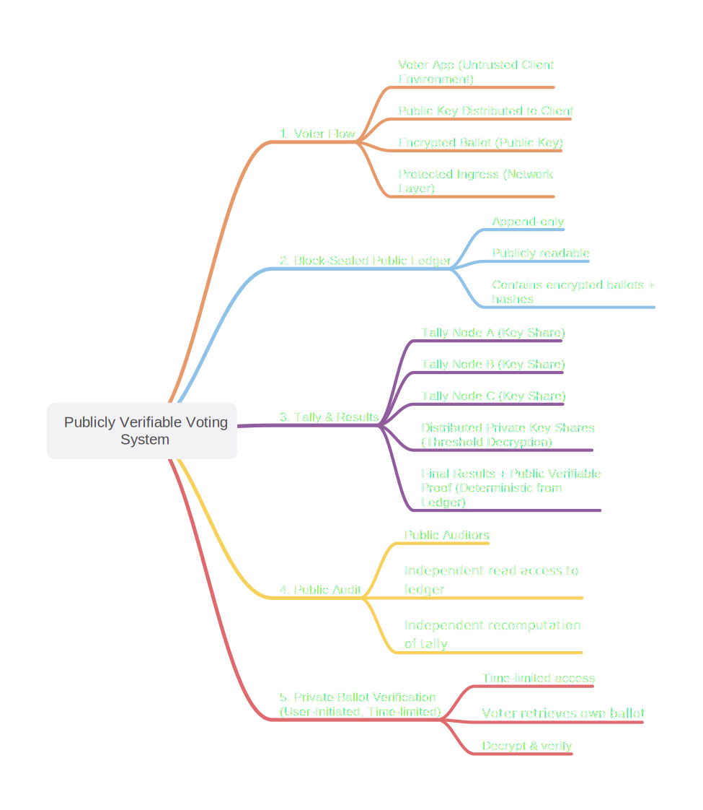

# Public Verifiable Voting System

This prototype demonstrates a path toward publicly verifiable elections, including municipal referendums and organizational governance.

It explores how cryptography can make election results independently auditable by anyone, without compromising vote secrecy.

---

## Live Demo

https://philchevaillot.github.io/public-verifiable-voting/

> Note: This demo decrypts individual ballots for clarity. Real systems use homomorphic tallying or threshold decryption to avoid exposing individual votes.

---

## System Architecture

This diagram illustrates a security-first architecture, emphasizing trust minimization, public auditability, and distributed decryption.

  

  <i>End-to-end flow: encrypted ballots → public ledger → distributed tally → independent audit</i>

---

## Security Model

This architecture represents an initial security-oriented design, focusing on:

- trust minimization (no single authority can alter or decrypt results)  
- public auditability (independent recomputation from the ledger)  
- distributed key management (t-of-n threshold decryption across nodes)  

Further work would include formal verification, adversarial modeling, and integration of zero-knowledge proofs or homomorphic tallying.

## Overview

This project proposes a publicly verifiable voting system designed to eliminate the need to trust centralized counting authorities while preserving strict vote secrecy.

The system allows any citizen to verify that:
- their vote was recorded
- their vote was counted
- their vote was counted correctly

without ever being able to prove their vote to a third party.

---

## Problem

Modern voting systems face three major challenges:

- Declining public trust in vote counting
- High operational cost of physical voting
- Low participation due to complexity and disengagement

Existing digital solutions often introduce new risks:
- central points of failure
- lack of transparency
- potential coercion or vote selling

---

## Solution

This system introduces a model based on:

- Public ledger for universal verification
- Homomorphic encryption for secure tallying
- Zero-knowledge proofs to ensure ballot validity
- Temporary, unlinkable voter identities
- One-time private vote verification

Key properties:

- No single point of trust
- Full public auditability
- Strong privacy guarantees
- No transferable proof of vote

---

## Key Principles

- One vote → one ballot
- Vote finality only upon public block publication
- First valid published ballot wins
- No intermediate confirmation states
- No backend trust required

---

## Verification Model

Each voter can verify (after results publication):

- their ballot was included
- it contributed to the correct outcome

This is achieved without revealing their identity or enabling coercion.

---

## Current Status

This project is currently at the **architecture and specification stage (V1.1)**.

The goal is to:
- refine the model
- validate assumptions
- explore implementation paths

---

## Full Specification (V1.1)
> Version 1.1 — Initial complete architecture draft

1. Identity Layer
- Each citizen has a 10-year long-term key pair
- Key is legally bound to the citizen, not the device
- One active trusted device at a time
- Device acts as secure execution environment only

2. Election Identity
- One temporary election identity per election
- Generated locally at voting time (not pre-generated)
- Derived/blinded and unlinkable across elections
- Authorized by long-term key
- Reusable across sessions for the same election
- Not persistent beyond election lifecycle

3. Session Model
- Multiple sessions allowed per election
- Same temporary identity reused
- No new identity created on retry
- Identity reconstructable securely during retries

4. Voting Rules
- One vote → one ballot
- No forks allowed
- One identity per election

5. Vote Finality
- Vote is final only when included in a published sealed block
- No intermediate state is valid
- App must display: “waiting for publication”

6. Pending vs Final State
- Pending: submission in progress, internally locked
- Final: published on public ledger
- Pending does NOT consume voting right

7. Failure Handling
- If interrupted before publication → vote lost
- User must restart from scratch
- No background retry allowed

8. Duplicate Handling
- If multiple ballots exist:
  - First included in a published sealed block wins
  - Others ignored

9. Vote Consumption
- Voting right consumed only at final publication

10. Ballot Structure
Each ballot contains:
- Temporary election identity
- Encrypted vote (vector-based, homomorphic)
- Zero-knowledge proof (ZKP)

11. Ballot Validity Proof (Mandatory)
ZKP must prove:
- Exactly one valid choice selected
- No multiple selections
- No inflated values
- Valid encoding structure
Proof must be publicly verifiable

12. Privacy Model
- No public mapping between identity and vote
- At no point should (temporary ID ↔ vote choice) be derivable, even transiently
- No transferable receipt possible

13. Private Verification (User)
- One-time reveal after results published
- Reveal key generated locally during voting
- Stored securely on device
- Used once, then destroyed
- Reveal shows only chosen option

14. Reveal Storage
- Reveal payload stored publicly (encrypted)
- Only decryptable with reveal key
- Reveal is non-transferable

15. Tally System
- Homomorphic encryption used for aggregation
- Votes combined without decryption

16. Final Decryption
- Only aggregate results decrypted
- Uses threshold cryptography (multiple key holders)
- No individual ballot decryption possible

17. Public Verification
- Entire ledger is public
- Anyone can verify:
  - Ballot validity (ZKP)
  - Tally correctness (ZKP)
- No trust in backend required

18. Security Principles
- No hidden states
- No backend trust
- Strict input validation
- System designed to absorb attacks

19. Infrastructure Principles
- Non-discoverable endpoints
- Layered DDoS resistance (network-level + protocol-level)
- Queue-based processing
- Fast block publication (seconds target)

20. Device Security
- Requires secure OS environment
- Keys stored in secure hardware
- Non-exportable secrets
- Compromised device → physical voting fallback

21. Physical Fallback
- User is either digital or physical voter
- Never both simultaneously

22. Governance Boundary
- System defines technical guarantees only
- Law enforcement, monitoring, and attribution handled by authorities

23. System Philosophy
- Full public verifiability
- Strong privacy guarantees
- Minimal trust assumptions
- Simplicity and determinism

SUMMARY:
A publicly verifiable, privacy-preserving voting system with no single point of trust and no transferable proof of vote.

## Notes

This is an open concept intended for discussion, review, and improvement.

Feedback is welcome.