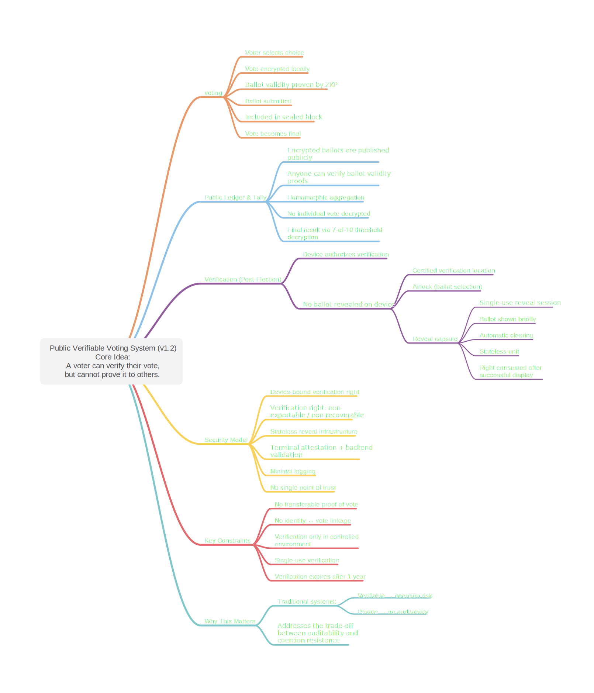

# Public Verifiable Voting System

Digital voting faces a fundamental challenge:  
making election results publicly verifiable without exposing individual votes or enabling coercion.

Most systems solve only part of the problem:

- verifiable systems risk leaking voter intent  
- private systems require trust in the authority  

This project proposes a different approach:

> A voter can verify their vote, but cannot prove it to others.

---

## Architecture Overview

The system combines public verifiability with strong coercion resistance through a constrained verification model.

*Figure: v1.2 architecture — voting, public ledger, verification flow, and constrained reveal mechanism.*

---

## Key Idea

The system combines:

- **public verifiability**  
  All ballots are published in encrypted form and can be independently verified by anyone.

- **strong privacy guarantees**  
  Votes remain unlinkable to voter identity and are never exposed in plaintext on personal devices.

- **constrained verification (v1.2)**  
  Ballot verification is:
  - available only after election closure  
  - limited to a short verification window  
  - performed on a certified terminal, not the voter’s device  
  - displayed briefly and cleared automatically  

- **non-transferable proof of vote**  
  Verification allows personal confirmation, but prevents durable or replayable evidence.

---

## What This Project Is

- an open system design for publicly verifiable elections  
- a working browser-based prototype demonstrating key concepts  
- an exploration of how cryptography and controlled verification can coexist  

---

## Documentation

- [System Overview (v1.2)](docs/system_overview_v1.2.md)
- [Full Security Specification (v1.2)](docs/security_full_spec_v1.2.md)
- [Threat Model (v1)](docs/threat_model_v1.md)

---

## Live Demo

https://philchevaillot.github.io/public-verifiable-voting/

> Note: The demo is simplified for clarity and runs fully client-side.  
> In a real deployment, private keys and verification infrastructure would be handled outside the browser.

Demo Reality Check

Implemented in the demo:
	•	RSA-OAEP encryption (Web Crypto)
	•	SHA-256 hashing and public ledger integrity
	•	Deterministic election identity (EID)
	•	End-to-end voting → publication → verification flow

Simulated in the demo:
	•	Zero-Knowledge Proofs (hash commitments only)
	•	Homomorphic tallying
	•	Threshold decryption (7-of-10)
	•	Certified verification terminals
	•	Hardware-backed device security

Intentional limitation:
	•	The private key is stored in localStorage (demo-only vulnerability)

⸻

Quick Demo (30 seconds)
	1.	Enter a display name and cast a vote
	2.	Observe your ballot appear in the public ledger
	3.	Close the election (System View)
	4.	View the tally and threshold decryption simulation
	5.	Authorize verification → see your vote on the terminal
	6.	Notice the verification right is consumed and cannot be reused

---

## How It Works

The system separates voting and verification into distinct phases.

### 1. Voting
- The voter selects a choice on their device  
- The vote is encrypted locally and never exposed in plaintext  
- A validity proof ensures the ballot is correctly formed  

### 2. Publication
- The encrypted ballot is published to a public ledger  
- Once included in a sealed block, the vote becomes final  

### 3. Tally
- Votes are aggregated using homomorphic encryption  
- Only the final result is decrypted  
- Anyone can independently verify the tally  

### 4. Verification (post-election)
- After the election closes, voters may verify their ballot  
- The voter device authorizes the process, but does not perform it  
- The ballot is revealed only on a certified terminal  
- The terminal operates within a controlled environment (e.g. private booth, no recording devices)  
- The display is brief, automatic, and cannot be repeated  

---

## What Makes This Different

Most digital voting systems expose a structural weakness:

- if voters can freely reveal their vote → coercion and vote buying become possible  
- if they cannot → verification requires trust in the authority  

This system addresses that trade-off.

- **Verification is decoupled from the voter device**  
  The device authorizes access, but never reveals the ballot  

- **Ballot exposure is constrained by design**  
  Verification occurs only in a controlled environment, for a short duration  

- **No transferable proof is produced**  
  The system does not generate any durable or replayable evidence of a vote  

- **Verification is single-use and time-limited**  
  Each ballot can be checked once, within a defined window  

- **Digital and physical voting are strictly separated**  
  A voter commits to one channel, preventing cross-system duplication  

---

This architecture preserves public verifiability while making large-scale coercion and vote buying significantly harder.

---

## Notes

This project is an open prototype and system design exploring publicly verifiable, trust-minimized voting.

It focuses on making core mechanisms — encrypted ballots, public ledger publication, and constrained voter verification — transparent and inspectable, while examining how verification can be provided without enabling transferable proof of vote.

The current implementation prioritizes clarity and observability over production security. It is intended to support analysis, discussion, and iterative refinement of the model, rather than represent a deployable system.

Feedback, critique, and thoughtful discussion are encouraged. Contributions are welcome, particularly in areas related to verification design, coercion resistance, and real-world deployment constraints.